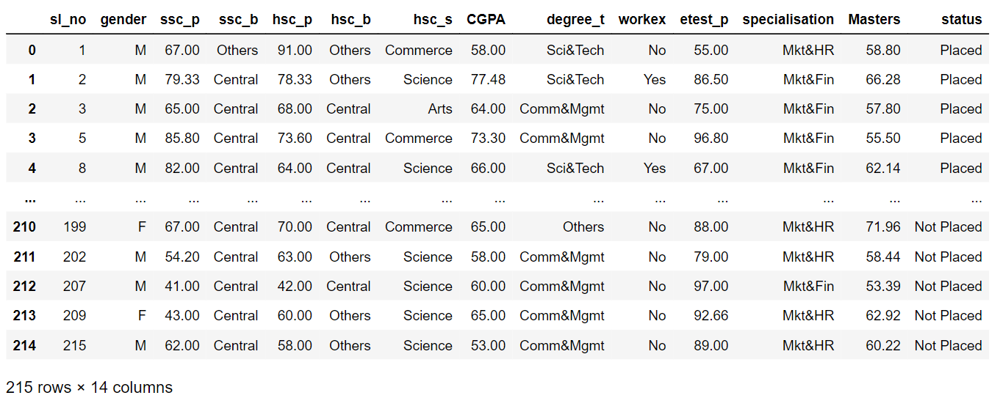

# Implementation-of-Logistic-Regression-Model-to-Predict-the-Placement-Status-of-Student

## AIM:
To write a program to implement the the Logistic Regression Model to Predict the Placement Status of Student.

## Equipments Required:
1. Hardware – PCs
2. Anaconda – Python 3.7 Installation / Jupyter notebook

## Algorithm

1. import the standard libraries.
2. Upload the dataset and check for any null or duplicated values using .isnull() and .duplicated() function respectively.
3. Import LabelEncoder and encode the dataset.
4. Import LogisticRegression from sklearn and apply the model on the dataset.
5. Predict the values of array.
6. Calculate the accuracy, confusion and classification report by importing the required modules from sklearn.
7. Apply new unknown values 

## Program:
```
/*
Program to implement the the Logistic Regression Model to Predict the Placement Status of Student.
Developed by: MOHAMED ROSHAN
RegisterNumber:  212222040101
*/
```
```py
#importing libraries
import numpy as np
import pandas as pd
import matplotlib.pyplot as plt

#reading the csv file
data=pd.read_csv('Placement_data_Full_Class.csv')
data

#dropping data
data=data.drop(['sl_no','gender','ssc_b','hsc_b'],axis=1)
data
data.shape
data.info()

#converting into category
data["hsc_s"]=data["hsc_s"].astype('category')
data["degree_t"]=data["degree_t"].astype('category')
data["workex"]=data["workex"].astype('category')
data["specialisation"]=data["specialisation"].astype('category')
data["status"]=data["status"].astype('category')
data.info()

#converting into catcodes
data["hsc_s"]=data["hsc_s"].cat.codes
data["degree_t"]=data["degree_t"].cat.codes
data["workex"]=data["workex"].cat.codes
data["specialisation"]=data["specialisation"].cat.codes
data["status"]=data["status"].cat.codes
data
data.info()

#selecting the features and labels
X = data.iloc[:, :-1].values
Y = data.iloc[:, -1].values
#display dependent var
Y

from sklearn.model_selection import train_test_split
X_train, X_test, Y_train, Y_test=train_test_split(X, Y,test_size=0.2)
#display
data.head()

X_train.shape
X_test.shape
Y_train.shape
Y_test.shape

#creating classifier using sklearn
from sklearn.linear_model import LogisticRegression
clf = LogisticRegression(random_state = 0, solver='liblinear', max_iter = 10000).fit(X_train, Y_train)
#printing the acc
#clf=LogisticRegression()
#clf.fit(X_train, Y_train)
clf.score(X_test, Y_test)

clf.predict([[65.00,58.00,0,84.00,0,0,65.0,0,57.80
             ]])

```

## OUTPUT:
### READING THE DATA

### DROPING THE DATA

### SHAPE AFTER DROP

### INFO BEFORE CONVERSION

### INFO AFTER CATEGORY CONVERSION

### DATA AFTER CADCODES CONVERSION

### INFO AFTER CADCODES CONVERSION

### DEPENDENT VARIABLE

### F1 SCORE

### UNKNOWN PREDICTED VALUE


## RESULT:
Thus the program to implement the the Logistic Regression Model to Predict the Placement Status of Student is written and verified using python programming.
